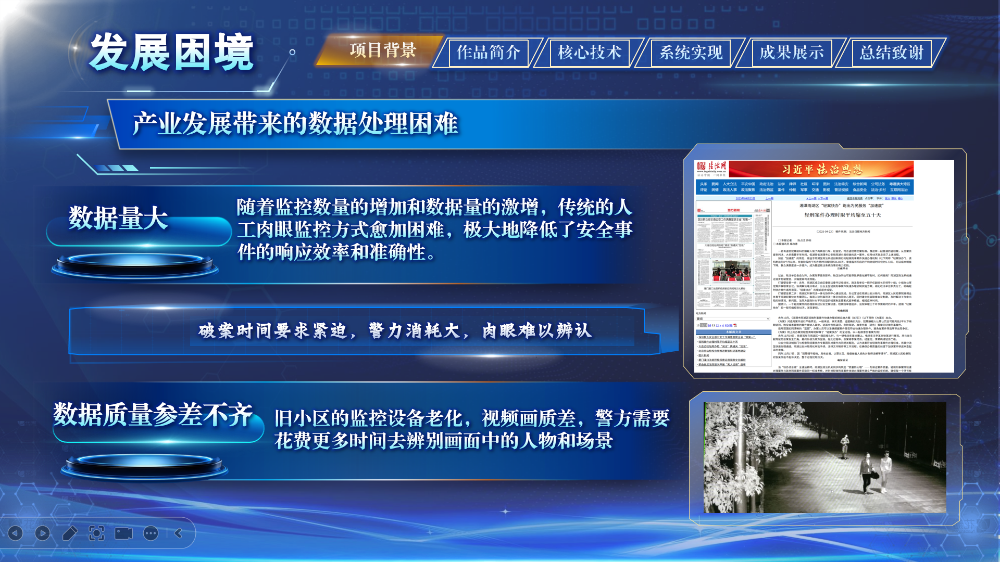
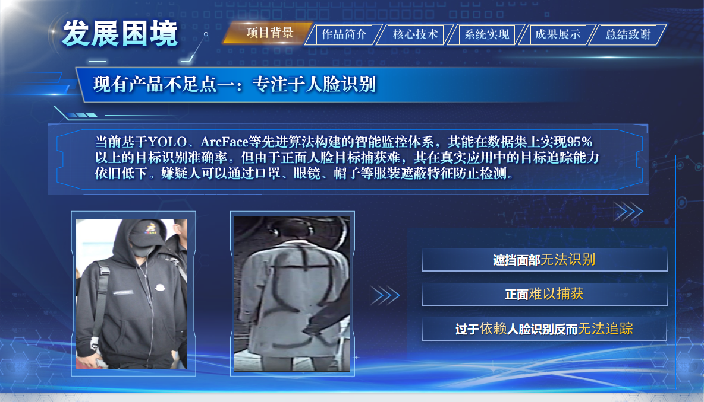
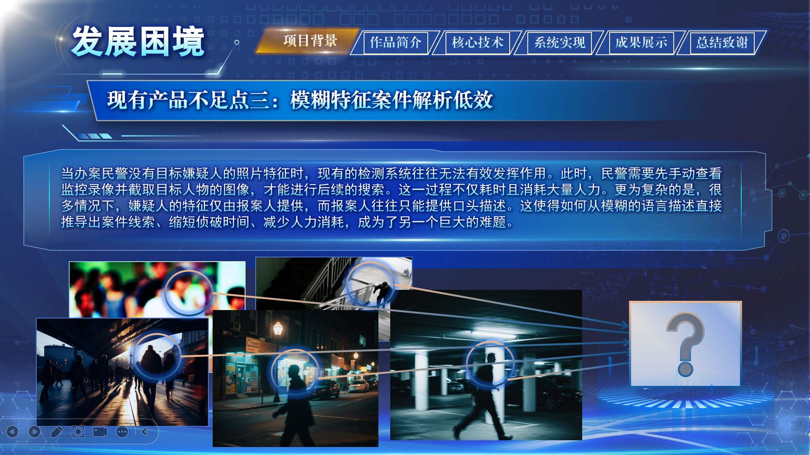
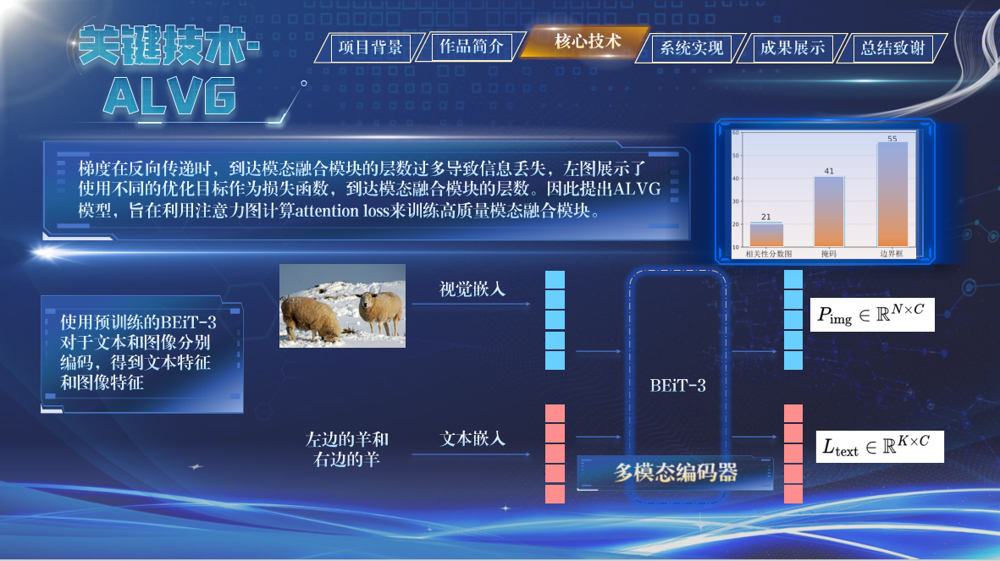
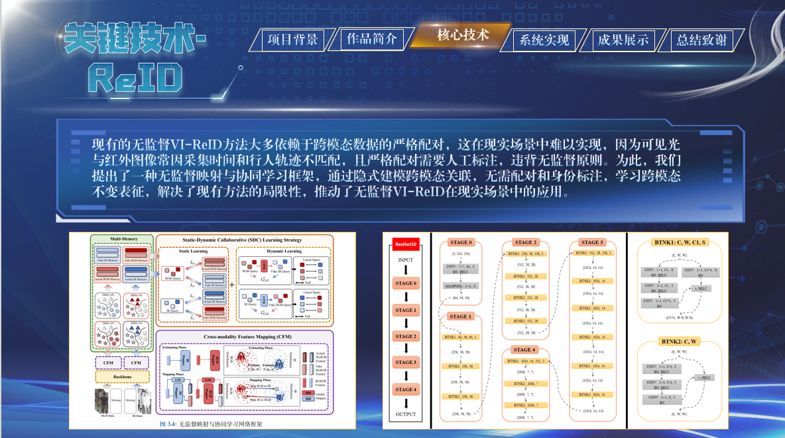
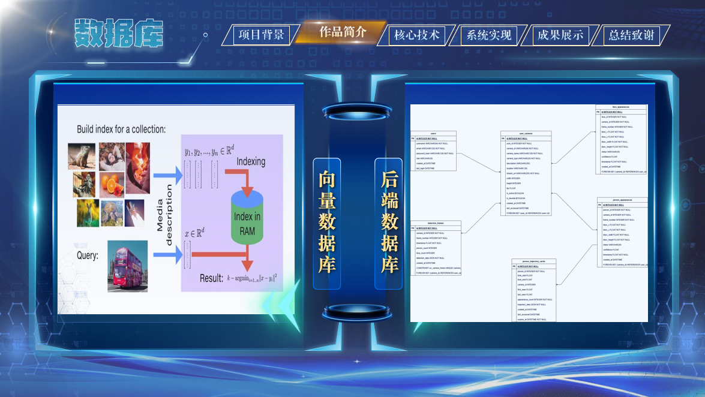
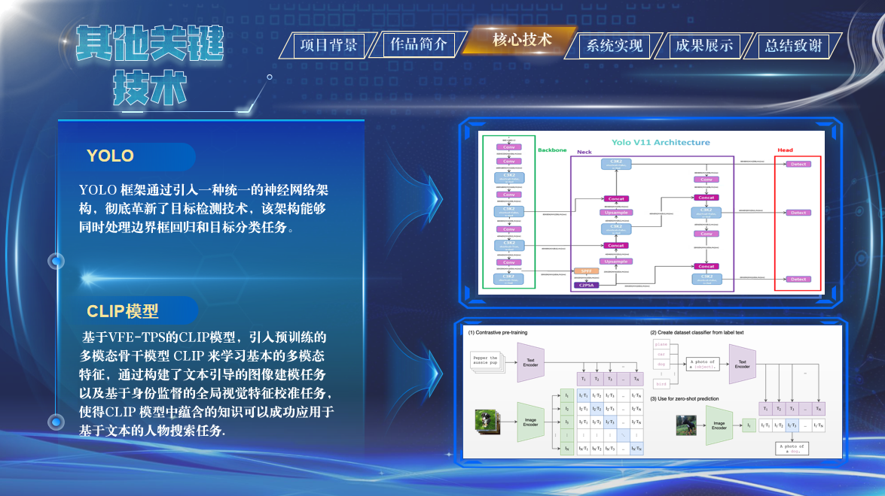
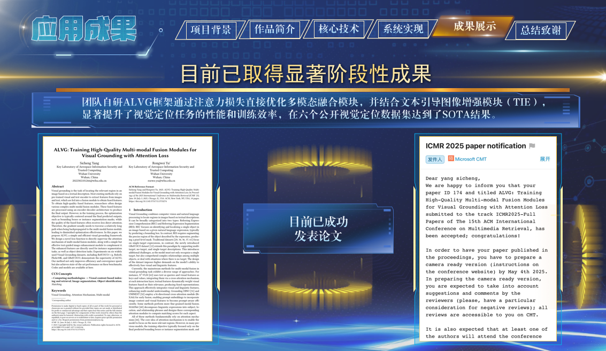

**多模安御：大数据驱动的多模态“天眼”系统**
随着我国城市化进程的加快，公共安全治理面临诸多挑战。案件类型日益复杂、基层警力紧张，传统依赖人力查看海量监控视频的方式已难以满足实际办案需求。因此，推进人工智能技术在监控安防领域的发展成为迫切需求。

目前，各个国家大力支持推进监控安防系统的发展，例如我国的雪亮工程以及天网工程等。

但目前已有系统仍有大量不足，例如“雪亮工程”推动了城市安防摄像头的高密度部署，但日均产生的大量监控视频仍缺乏智能化利用手段。现有系统大多依赖人脸识别数据库比对，难以适应真实复杂环境。

- 人脸识别技术的局限性

	传统监控系统在人脸识别标准数据集上表现优异，但在实际应用中，嫌疑人往往通过佩戴口罩、眼镜等方式遮挡面部，导致识别失败，系统目标追踪能力较弱。

- 轨迹分析支持不足
	当前智能监控系统缺乏对行为轨迹、时间与空间信息的融合分析，缺少对历史数据的深入挖掘能力，难以有效支持案件溯源与综合研判。

- 缺乏多模态综合信息分析能力
	在侦查实践中，人物轨迹分析尤为重要。警方需花费大量时间手动翻查录像来重建嫌疑人行踪，效率低下。对于缺乏图像资料、仅有语言描述等模糊线索的案件，现有系统无能为力，使得侦破难度加剧、人力成本激增。

- 数据壁垒与“数据孤岛”问题
	跨区域案件频发暴露出安防数据壁垒严重。由于隐私保护和数据合规要求，各地安防数据难以集中共享，AI 模型训练数据受限，跨域识别精度下降，制约了智能监控系统的整体效能与实战价值。

<table style="border-collapse: collapse; border: none; padding: 0; margin: 0;">
  <tr>
    <td style="border: none; padding: 0;"></td>
    <td style="border: none; padding: 0;"></td>
  </tr>
  <tr>
    <td style="border: none; padding: 0;"></td>
    <td style="border: none; padding: 0;"></td>
  </tr>
</table>

**“多模安御”系统的创新解决方案**

我们考虑了以上诸多缺陷，最终提出一项创新解决方案，多模安御-大数据驱动的多模态‘天眼’系统。

“多模安御”系统是一款专为公安实战场景设计的智能视频分析平台，聚焦嫌疑人定位与行为轨迹还原难题。

平台融合多模态深度学习、视觉语言对齐、行人重识别与联邦学习等前沿技术，打破传统依赖人脸识别的限制。即使缺乏清晰人像信息，也能通过语言描述或模糊线索，实现跨视频、跨时间的人物定位与追踪。

系统构建了完整的多模态检索链路，结合自研视觉定位算法（ALVG）与无监督行人重识别模型（VI-ReID），实现复杂场景下目标人物的准确检索与轨迹重建。

无论嫌疑人有伪装、图像清晰度低或现场无完整图像资料，系统都能从海量视频中挖掘潜在线索，显著提升案件还原效率。

此外，本系统还具有以下两个优势

**联邦学习与大数据融合**

系统采用联邦学习机制，在保障隐私与数据安全的前提下，实现跨区域数据协同分析，突破“数据孤岛”限制，增强跨域追踪能力。

平台还具备强大的大数据分析能力，能自动整合历史检测数据，构建人物时空行为画像，为案件侦查提供全方位支持。

**实战应用与操作便捷性**

平台配备可视化操作界面，支持警务人员高效完成视频检索、目标布控与轨迹分析等操作，真正实现从线索输入到智能预警的闭环式办案流程。

在核心技术方面，我们系统在两个技术方面做出创新性的突破。

1、搭建ALVG架构实现Visual Grounding算法的突破，实现人物搜索功能

2、融合红外视觉模态的联邦学习Reid系统，实现针对行人的重识别功能。

3、构建双数据库，Faiss向量数据库以及常规数据库，实现快速数据存取

4、多模态任务搜索以及高精度人脸识别，使用基于VFE-TPS的Clip模型实现文本搜索任务。

目前基于本作品已落实1项推广证明、1篇CCF-B学术论文收录，1篇CCF-A学术论文再投以及专利软件著作正在申请

