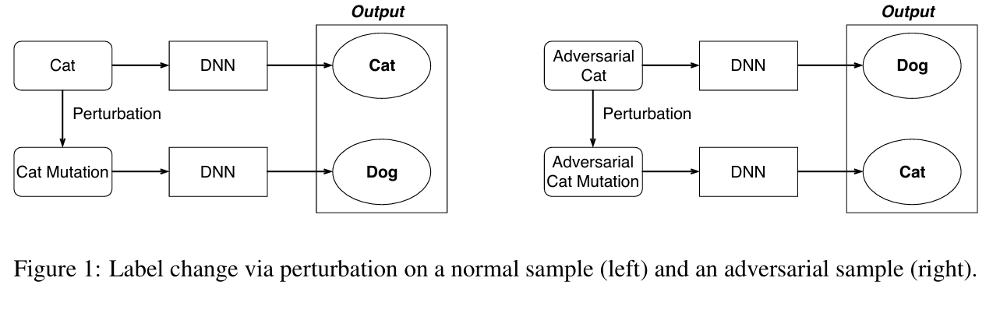

## 引入

它们共享相似的对抗性噪声优化过程，这使得对抗性噪声（ 例如 ，扰动、补丁等）能够获得对抗性攻击能力。然而，使 PAE 与众不同的关键过程是对抗性模式制造过程和对抗性示例重新采样过程。在制造过程中，对手通过各种方法制造对抗性图案，例如生产材料对象和玩弄各种投影设备或音频设备。对于计算机视觉任务，此过程的输出可以是对抗性补丁 [12]、对抗性帽子 [13]、对抗性 T 恤 [14]、对抗性照明 [15] 等 。对于音频识别任务，此过程的输出可以是对抗性音频音乐 [16]、对抗性音频噪声 [17] 等 。在重新采样过程中，制造的对抗性物理模式将被放入真实场景（ 即不同的环境）中，以依次进行攻击。这些物理对抗模式可以被不同的采样器采样为重新采样的数字对抗模式，并努力误导或愚弄现实世界中基于深度学习模型的智能设备。 具体来说，这个过程中的采样器可以是相机、磁带记录仪、录像机、红外成像仪、智能手机等 

２０１９年瑞莱智慧 RealAI团队对人脸照片进行 算法处理,将照片打印并粘贴到镜框上,通过佩戴眼 镜成功攻破１９款商用手机的人脸解锁[１];２０２０年 美国东北大学团队[２]设计了一款印有特殊图案的 T 恤,可使穿戴者躲避智能摄像头的监测;２０２１年腾 讯科恩实验室[３]通过在路面部署干扰信息,导致特 斯拉 ModelS车辆经过时对车道线做出错判,致使 车辆驶入反向车道􀆺􀆺 由此可见,尽管深度学习在执行各种复杂任务 时取得了出乎意料的优异表现,但在安全应用领域 仍有很大的局限性．Szegedy等人[４]发现,深度学习 对于精心设计的输入样本是很脆弱的．这些样本可 以轻易用人类察觉不到的微小扰动,欺骗一个训练 好的深度学习模型,使模型做出错误的决策．现在, 深度学习中的对抗攻击技术受到了大量关注,以面 向图像分类为主的对抗攻击算法[５Ｇ１０]不断涌现． 在此背景下,越来越多的研究者开始关注如何 提升模型抵御对抗攻击的能力,即增强模型的对抗 鲁棒性,并探索出了一系列的对抗防御手段,如梯度 遮蔽[１１Ｇ１２]、对 抗 训 练[６,１３]、数 据 处 理[１４Ｇ１５]和 特 征 压 缩[１６]等．尽管这些方法对于改善模型的对抗鲁棒性 是有效的,但是目前针对模型对抗鲁棒性的评估框架 尚未完善,主要是通过不断改进攻防算法,反复进行 对抗,定性给出模型鲁棒性好坏的基准,或者使用分 类准确率等指标单一地衡量模型的对抗鲁棒性．此 外,许多攻击算法或多或少会受到实验条件的限制, 难以适用于所有的深度学习模型,这些问题为模型 的对抗鲁棒性评估(adversarialrobustnessevaluation) 带来了挑战．

随着移动互联网飞速发展、硬件设备持续升级、海量数据产生和算法不断更新，人工智能(artificialintelligence,AI)的发展已势不可挡，正逐渐渗透并深刻地改变着人类生产生活.深度学习(deeplearning,DL)技术及其应用的发展令人瞩目，使强人工智能离人类生活越来越近.目前，基于深度学习的智能技术被广泛应用在人机交互、视觉处理、智能决策、自治系统、推荐系统、安全诊断与防护等各个领域.目前，以深度学习为主要代表的人工智能开始进入产业化开发与深耕阶段，促进了各个领域的深刻变革.例如，深度学习驱动的数据分析技术已经从根本上改变了现有的视频监控、医疗健康和金融管理等系统的开发和应用.在安全领域，最新的检测防护系统能够利用深度学习技术从大规模数据资源中快速准确地提取出有用的可执行信息.尽管深度学习被认为是深刻改变人类社会生活、改变世界的颠覆性技术，但是与任何一种先进技术发展和应用的过程类似，当面向用户的服务越来越成熟，客户资源逐渐增长，最终安全性会成为进一步广泛部署人工智能系统的最大挑战.以深度学习为代表的人工智能技术，至今仍然是一个黑匣子.目前对深度学习模型的内在脆弱性以及针对其弱点设计的对抗性攻击技术的理解尚不充分，需要基础理论揭示深度学习背后的机理.但是深度学习模型参数规模大、结构复杂、可解释性差,对于对抗性攻击的生成机理分析十分困难.针对这些问题，目前已有相关研究尝试对各种对抗性攻击的作用机理进行解释14匕其次，深度学习框架在软件实现中不断暴露出新的漏洞，对抗性攻击的恶意样本生成和训练数据的污染致使系统形成漏判或者误判［42-77］，甚至导致系统崩溃或被劫持.与此对应，目前研究者们有针对性地提出了多种防御方法［78119］,如模型隐私保护、模型鲁棒性增强以及输入样本对抗噪声检测与擦除等，以增强深度学习模型的抗攻击能力.同时，从系统的角度考虑，深度学习模型的攻击、防御的研究不能是单一、碎片化的，需要建立深度学习模型的对抗性攻击和防御框架，目前这方面的研究还处于起步阶段［120146］.由于不同学者所处的研究领域不同，解决问题的角度不同，针对深度学习模型攻击与防御研究的侧重点不同，因此亟需对现有的针对人工智能的隐私保护的研究工作进行系统地整理和科学地分析、归纳和总结.在本文中，我们首先介绍了深度学习模型生命周期与安全威胁，然后从对抗性攻击生成机理、对抗性攻击生成方法、对抗攻击的防御策略、对抗性攻击与防御框架4个角度对现有的深度学习模型攻击与防御方法进行系统地总结和科学的归纳并讨论了相关研究的局限性.最后，我们在现有基础上提出了针对深度学习模型攻击与防御的基本框架，并展望了深度学习模型对抗性攻防的未来研究方向.1深度学习生命周期与安全威胁深度学习模型是当前人工智能系统大爆发的核心驱动，主要包括训练和推理2个阶段.在训练阶段,首先构建训练数据集，然后利用训练集对模型参数

## 防御分类

在防御方面，提高DNN鲁棒性的一个主要工作是通过对抗性训练，它用对抗性数据增强训练数据，并修改训练阶段，使攻击者更难制作对抗性样本[32,8,15,17,34,26,22,10,6,11,28,30]。除了对抗性训练，另一道防线是通过从对抗性数据中训练辅助模型[18,37]或测试训练数据与对抗性数据之间的统计差异来检测对抗性样本

## 防御方法

## 检测方法

### Detecting Adversarial Samples for Deep Neural Networks through Mutation Testing

由于对抗样本对于微小样本的鲁棒性更差，可以通过向样本添加微小扰动查看模型结果是否改变来判断该样本是否是对抗样本，也即对抗性样本添加微小扰动后改变label的可能性更大，通过一个阈值来对普通样本和对抗性样本进行分类

**该方法主要用在分类问题上，不依赖对抗样本库**

left  
manipulating the
 original sample with minor modifications so that the DNN model labels the sample incorrectly. 

right
 the probability of obtaining a different label by imposing random perturbations to an
 adversarial sample is significantly higher that of imposing random perturbations to a normal sample.

面向智能视频监控目标跟踪的对抗样本生成技术研究

> 如今，视频监控系统正在面向图像高清化、设备联网化、网络无缝化的方向快速发展，从而导致了视频监控数据量的激增。在海量的视频监控数据面前，智能视频监控技术通过将计算机视觉、人工智能等前沿技术相融合，能够辅助甚至替代人工对海量的监控数据进行分析，成为了视频监控系统未来的发展趋势。然而，在智能视频监控系统中，数据面临着被篡改的风险，包括图像替换、背景伪装、对抗样本攻击等方式。其中，对抗样本攻击是一种能够通过在图像上添加微小干扰使智能视频监控算法失效的攻击方式，具有非常高的破坏作用。在众多智能视频监控算法中，目标追踪算法是对抗样本攻击的主要目标之一。为了提高智能视频监控系统对数据安全的重视，并且激发建设更加稳定可靠的智能视频监控系统，需要研究破坏性更强的面向目标跟踪的对抗样本生成算法。

# 我们的项目

视盾探察 - 智能视频监控物理对抗样本攻击检测分析平台

基于现有的人脸人体检测识别，以及多模态识别模型添加针对**物理对抗样本攻击的检测与分析平台**

## 对抗样本攻击 

对抗样本攻击通过向图像数据加入人类难以察觉的微小扰动，进而造成深度神经网络推理与识别失准，导致图像分析任务的准确率下降。对抗样本既可以单纯在数字空间修改生成, 也可以在物理世界构造生成。
数字空间的对抗样本可以映射到物理世界中, 但其攻击效果往往并不尽如人意。原因在于数字空间对抗样本的扰动难以被打印机无色差地打印, 且无法被摄像头无像素损失地拍摄后转换为数字信号。
物理对抗补丁通常是一个图案化的子图像, 覆盖在原图像的局部区域上, 打印后以海报、贴纸、眼镜等多种形式在物理世界中实现对抗攻击。
例如 T 恤、帽子和贴纸中的矩形或圆形形式或眼镜、照明等中的任意形式。
**我们主要考虑的是物理对抗样本的检测与分析。**

假设系统接入的依旧是网络摄像头的实时视频流，我们的系统主要实现对物理对抗样本攻击的检测。

## 对抗样本攻击危害

1. 绕过目标检测， 如穿戴特定的对抗样本服装绕过人体检测，从而做到在ai监控摄像头下的“隐身”。攻击者可以通过配到对抗样本逃过智能追踪摄像头的检测。
2. 干扰人脸识别，人体识别，攻击者可能通过在眼镜上添加微小的对抗性图案，使模型无法正确识别佩戴者的身份。攻击者可以利用对抗样本欺骗人脸识别系统，非法获取他人的个人信息或资金。此外，对抗性攻击还可能威胁到国家安全和社会稳定，比如破坏智能监控系统和无人机防御系统等。
   
3. 在自动驾驶系统中，通过对交通标志进行微小修改，可以引发车辆产生危险的行为。

## 物理对抗样本攻击的分类

### 人工设计的对抗样本

长期以来，攻击者一直试图干扰成像过程或混淆目标对象（例如身体和面部），利用伪像来隐藏真实身份，避免被识别。这些干扰/混淆伪像种类繁多，既包括用于隐藏身体部位目标的简单物品（例如 3D 面罩、面部珠宝以及围巾、面罩或 T 恤上的复杂图案），也包括用于干扰监控软件的可调噪声（例如 LED 眼镜和化妆品），用于针对监控软件的弱点。由于这些传统方法严重依赖人类知识来设计和优化对抗伪像，通常仅限于简单的检测和识别算法或软件，而非最先进的方法。此外，诸如人体跟踪和动作识别之类的时间监控任务通常非常复杂，人类难以解读和研究。需要注意的是，所有方法都实施了非目标攻击。

佩戴口罩是避免被识别的最明显选择。  
日本国立信息学研究所设计的 LED 眼镜在其眼睛和鼻子周围有特定布置的 LED 灯，可以在任何距离阻挡人脸检测软件。

### 机器学习对抗性攻击

#### 针对人体检测

鲁汶大学的研究人员表明，专门设计的贴片小至 40 厘米× 40 CM 可以成功地欺骗最先进的人体探测器，使其认为一个人不是人，或者能够从基于 AI 的安全摄像头系统中隐藏人。这些对抗性补丁被印在纸上，可以随身携带，也可以印在 T 恤等服装上，以挑战现实世界中的检测。

Liu 等人通过设计对抗性补丁将这一想法扩展到目标检测，该补丁可以放置在图像中的任何位置，从而导致图像中的所有现有目标被探测器完全错过。它们同时攻击边界框回归和对象分类。他们提出了 DPatch，这是一种像素 40×40 大小的对抗性补丁，当添加到任何图像中时，可能会将 Faster R-CNN 和 YOLO 的平均精度 （mAP） 分别从 75.10% 和 65.7% 降低到 1% 以下。DPATCH 在检测器和数据集之间显示出很好的可转移性。

#### 针对身份识别

卡内基梅隆大学的研究人员表明，专门设计的眼镜架甚至可以骗过最先进的面部识别 ArcFace.眼镜不仅可以使佩戴者基本上消失在这种自动化系统中，而且它甚至可以欺骗他们认为您是其他人。眼镜上的对抗模式可以类似于 Section II-B 中提出的框架来学习。该模式通过对齐的面孔对抗性地映射到主体的脸上。标识丢失将反向传播以迭代方式更新模式。然而，Sharif 等人并没有直接优化模式，而是采用了带有生成器的 GAN 架构来学习对抗模式的分布。

来自罗蒙诺索夫莫斯科国立大学和华为莫斯科研究中心的 Komkov 和 Petiushko设计了一个矩形纸贴纸，可以贴在帽子上，以便在多种拍摄条件下欺骗 ArcFace

#### 针对重识别

Wang 等人设计了一个对抗性补丁来攻击 Re-ID 系统。对抗性补丁是对抗性映射到每个主体的主体上，并通过最小化 Re-ID 任务损失和物理损失来学习的，类似于 Section II-B 中提出的框架。任务损失旨在最小化来自两个不同相机的同一主体的两张图像之间的相似性，并最大化来自同一相机的同一主体的两张图像之间的相似性。电视被用作物理损失。非目标攻击的优化问题表述为

#### 针对人类跟踪

Wiyatno 和 Xu 提议学习物理对抗纹理（PAT），将其打印在海报上或在电视上展示在背景上，以混淆现实世界的跟踪系统

## 物理对抗样本攻击的检测防御方法

### 

### 训练一个 Ad-YOLO识别对抗性样本

使用一个增强的 Pascal VOC 数据集，真实和对抗的补丁图像入到 Pascal VOC 数据集中。

### 训练一个对抗性贴片检测器

作者首先将输入图像分成多个补丁（可以是偶数或随机补丁），然后，训练检测器进行可疑检测，随后在将人脸图像提供给人脸识别系统之前对其进行过滤。该系统使用真实的人脸图像和使用白盒攻击生成的对抗性图像进行训练，并且仅在数字白盒防御模型泄露攻击中进行了测试。

### Detecting Adversarial Samples for Deep Neural Networks through Mutation Testing

由于对抗样本对于微小样本的鲁棒性更差，可以通过向样本添加微小扰动查看模型结果是否改变来判断该样本是否是对抗样本，也即对抗性样本添加微小扰动后改变label的可能性更大，通过一个阈值来对普通样本和对抗性样本进行分类

### SentiNet:Detecting Physical Attacks Against Deep Learning Systems	

基于深度学习的通用物理攻击检测框架

